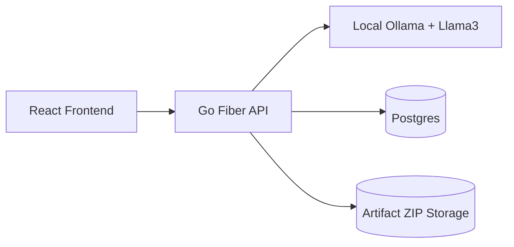
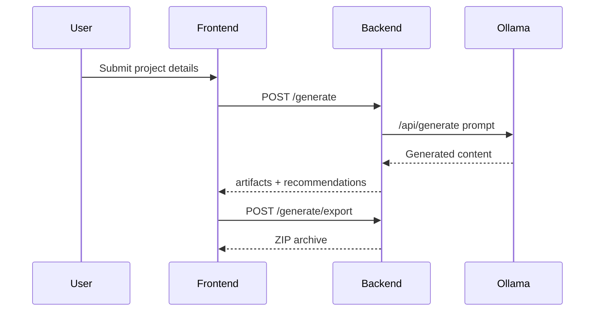

# System Design

## High-Level Architecture

```mermaid
flowchart LR
UI[React Frontend] --> API[Go Fiber API]
API --> OLLAMA[Local Ollama + Llama3]
API --> DB[(Postgres)]
API --> STORE[(Artifact ZIP Storage)]
```

## Sequence Diagram

```mermaid
sequenceDiagram
participant U as User
participant F as Frontend
participant B as Backend
participant L as Ollama
U->>F: Submit project details
F->>B: POST /generate
B->>L: /api/generate prompt
L-->>B: Generated content
B-->>F: artifacts + recommendations
F->>B: POST /generate/export
B-->>F: ZIP archive
```
